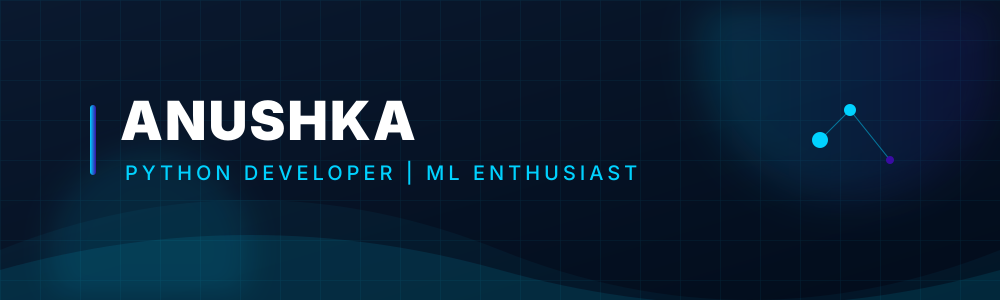

  

    

  

    

  <h3>Python Developer | Machine Learning Enthusiast | Streamlit Developer</h3>

  

    Passionate about building practical applications and continuously learning new technologies.
  

  

    

  

# 👩💻 About Me

Hi, I'm **Anushka Singh**, a B.Sc. Information Technology student with a passion for software development, machine learning, and building practical solutions using Python.

I enjoy developing interactive web applications, exploring data-driven technologies, and continuously expanding my knowledge in modern software development. I believe in writing clean, maintainable code while creating projects that solve real-world problems.

Alongside my technical journey, I bring **3 years of teaching experience**, which has strengthened my communication, leadership, mentoring, and problem-solving skills. I enjoy collaborating with others, simplifying complex concepts, and continuously improving myself both technically and professionally.

I'm currently looking for opportunities to apply my skills, contribute to meaningful projects, and grow as a software developer while learning from experienced professionals.

# 💻 Tech Stack

 

### 📚 Technologies & Skills

| Category | Skills |
|----------|---------|
| **Programming** | Python, JavaScript, SQL |
| **Web Development** | HTML5, CSS3, Streamlit |
| **Machine Learning** | Pandas, Machine Learning Fundamentals |
| **Database** | SQLite |
| **Tools** | Git, GitHub, VS Code |
| **Professional Skills** | Communication, Problem Solving, Critical Thinking, Teamwork, Project Management |

# 🚀 Featured Project

## 🔐 Cybersecurity Threat Detection Web Application

Developed a **Cybersecurity Threat Detection** web application using **Python** and **Streamlit**.

### Features

- Interactive dashboard for threat monitoring
- User-friendly interface for security analysis
- Python-powered data processing
- Real-time visualization of cybersecurity insights
- Clean and responsive design

### Tech Stack

- Python
- Streamlit
- Pandas

### Live Demo

🔗 https://cybersecurity-threat-detection-gwmsyma48ynpyzknbf39a3.streamlit.app/

# 📊 GitHub Statistics

 

### 🐍 Contribution Snake

<picture>
  <source media="(prefers-color-scheme: dark)" srcset="https://raw.githubusercontent.com/anushkaa22/anushkaa22/output/github-contribution-grid-snake-dark.svg">
  <source media="(prefers-color-scheme: light)" srcset="https://raw.githubusercontent.com/anushkaa22/anushkaa22/output/github-contribution-grid-snake.svg">
  
</picture>

# 🌱 Currently Learning

- Machine Learning
- Python Development
- Data Analysis with Pandas
- Streamlit
- SQL
- Cybersecurity Fundamentals

### ⭐ Thanks for visiting my profile!

*"Learning, Building and Growing Every Day."*

